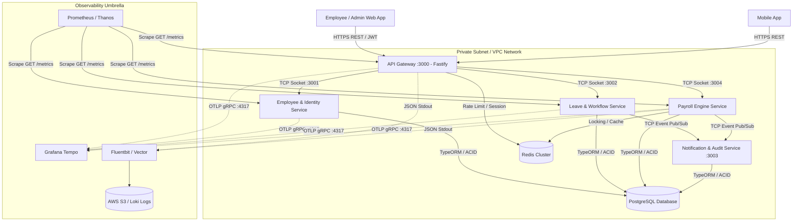
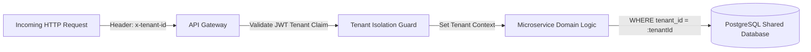
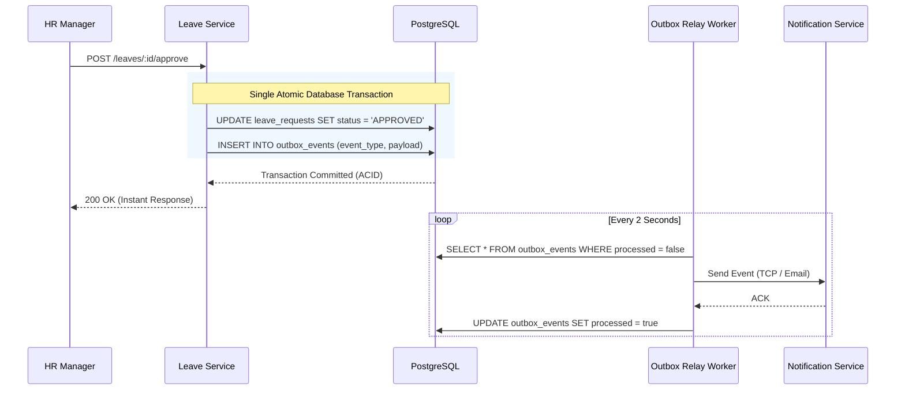
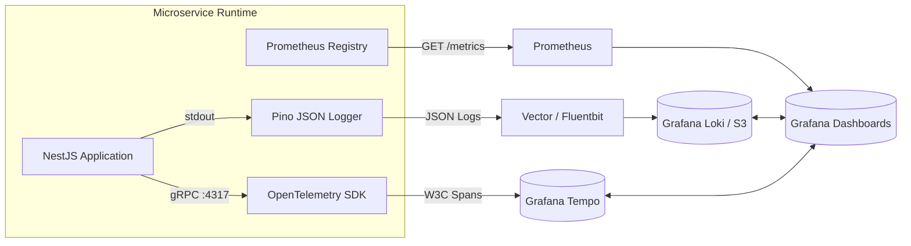

# High-Level Design (HLD) Document
## System Name: WorkforcePulse Enterprise Platform Architecture

---

## 1. System Architecture Diagram



---

## 2. Microservice Mesh Topology

| Service Name | Protocol | Port | Responsibilities |
| :--- | :--- | :---: | :--- |
| **`api-gateway`** | HTTP / Fastify | `3000` | Perimeter routing, Rate-limiting, DTO validation, JWT auth, Tenant isolation (`x-tenant-id`), Swagger docs. |
| **`employee-service`** | TCP Socket / HTTP Metrics | `3001` | Employee onboarding, profiles, department assignments, salary setup, manager reporting hierarchies. |
| **`leave-service`** | TCP Socket / HTTP Metrics | `3002` | Leave request state machine (`SUBMITTED` ➔ `MANAGER_APPROVED` ➔ `HR_VERIFIED` ➔ `PAYROLL_LOCKED`), balance tracking. |
| **`notification-service`** | TCP Socket / HTTP Metrics | `3003` | Transactional email alerts (HTML templates) & immutable HR compliance audit logging. |
| **`payroll-service`** | TCP Socket / HTTP Metrics | `3004` | Monthly payroll runs, gross-to-net salary calculations, tax withholdings, pay slip generation. |

---

## 3. Network Security & VPC Boundary

```text
               PUBLIC INTERNET (0.0.0.0/0)
                            │
                            ▼ (Port 443 HTTPS / TLS 1.3)
   ┌─────────────────────────────────────────────────────────────┐
   │ PUBLIC SUBNET (DMZ Boundary)                                │
   │   [ AWS ALB / Nginx Load Balancer ]                         │
   │          │                                                  │
   │          ▼                                                  │
   │   [ API Gateway (Fastify Engine) - Port 3000 ]               │
   │   • Rate Limiting Guard                                     │
   │   • JWT Auth & Multi-Tenant Isolation                       │
   └──────────────────────────────┬──────────────────────────────┘
                                  │ (Internal TCP / Private Subnet: 10.0.0.0/16)
                                  ▼
   ┌─────────────────────────────────────────────────────────────┐
   │ PRIVATE SUBNET (Isolated VPC - No Public IPs)               │
   │                                                             │
   │   [ Employee Svc :3001 ]        [ Leave Svc :3002 ]         │
   │   [ Notification Svc :3003 ]    [ Payroll Svc :3004 ]       │
   │                                                             │
   │   • Private PostgreSQL DB (:5432) & Redis (:6379)           │
   └─────────────────────────────────────────────────────────────┘
```

---

## 4. High-Availability, Scalability & Failover Strategy

### A. Horizontal Pod Autoscaling (HPA)
- **API Gateway**: Auto-scales based on CPU utilization (> 70%) or incoming HTTP requests per second (> 2,000 req/sec per pod).
- **Payroll & Leave Microservices**: Auto-scales based on active job queues and CPU utilization.

### B. Database High-Availability (PostgreSQL Aurora Multi-AZ)
- **Primary Node**: Handles write transactions (`INSERT`, `UPDATE`, `DELETE`).
- **Read Replicas**: 2+ Read Replicas handling heavy read traffic (`GET /employees`, `GET /reports`).
- **Automatic Failover**: Aurora automatically promotes a Read Replica to Primary in < 30 seconds if the Primary fails.

### C. Redis Caching & Distributed Lock Cluster
- **Redis Sentinel / Cluster**: 3-node primary/replica configuration with automatic failover.
- **Lock Expiry Guard**: All distributed locks (`lock:payroll:...`) use TTLs (Time-To-Live) and atomic Lua scripts (`releaseLock`) to prevent deadlock states if a worker node crashes.

---

## 5. Multi-Tenancy Architecture & Data Isolation

WorkforcePulse uses a **Pooled Multi-Tenancy Model with Row-Level Security (RLS)**:



- **Data Isolation**: Every SQL query is automatically scoped with `WHERE tenant_id = :tenantId` enforced at the TypeORM repository layer.
- **Data Encryption**:
  - **In-Transit**: TLS 1.3 encryption across all internal microservice communications.
  - **At-Rest**: AWS KMS AES-256 database storage encryption; bank account routing numbers encrypted using field-level AES-256-GCM.

---

## 6. Event-Driven Architecture & Transactional Outbox Pattern

To prevent distributed transaction failures across microservices (e.g. Leave Approved but Notification Email fails), we implement the **Transactional Outbox Pattern**:



---

## 7. Security, Compliance & Authentication Architecture

- **Authentication Protocol**: OAuth2 / OpenID Connect using JWT (JSON Web Tokens).
  - **Access Token**: Short-lived (15 minutes), signed via RSA-256 / HS256, carrying `userId`, `tenantId`, `roles`, and `permissions`.
  - **Refresh Token**: Long-lived (7 days), stored hashed in PostgreSQL with revocation support (`isRevoked: boolean`).
- **Authorization Model**: Fine-Grained Role-Based Access Control (RBAC).
- **Compliance Audit Logging**: Every mutation (`CREATE`, `UPDATE`, `DELETE`) writes an immutable record to `audit_logs` capturing `actor_id`, `action`, `old_value`, `new_value`, and `ip_address` for SOC2 & GDPR compliance.

---

## 8. Cross-Cutting Observability Pipeline (The 3 Pillars)



- **Distributed Tracing**: OpenTelemetry Node SDK automatically propagates `traceparent` headers across HTTP and TCP microservice boundaries.
- **Log Correlation**: Every log output includes `traceId`, `spanId`, `correlationId`, `service`, and `tenantId`.
- **Metrics & Exemplars**: Prometheus records latency histograms (`http_request_duration_seconds`) paired with OpenTelemetry trace exemplars for instant click-through from dashboard metrics to raw trace spans.
