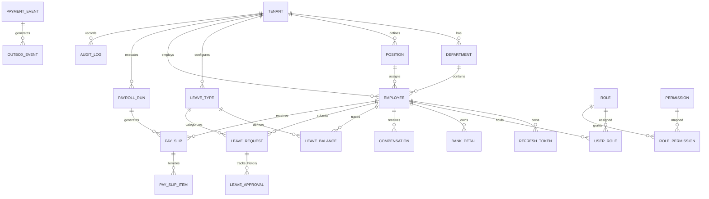
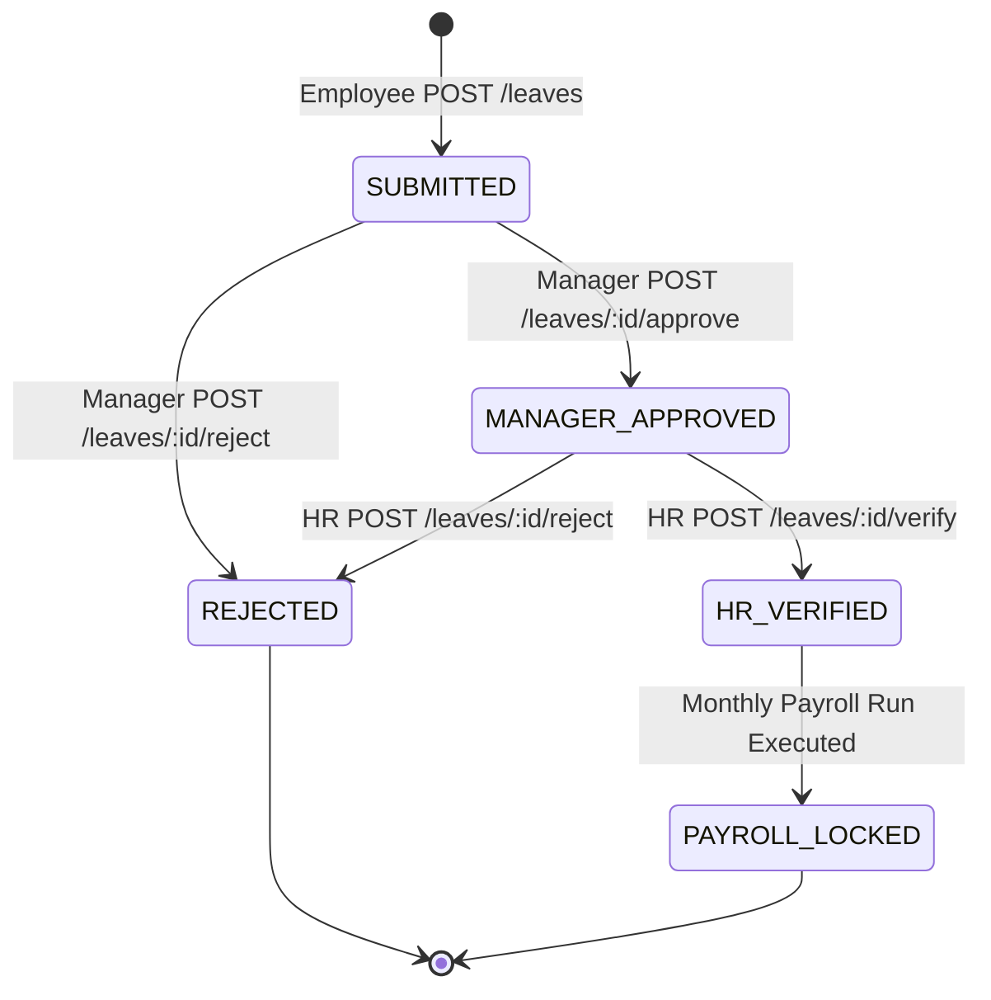
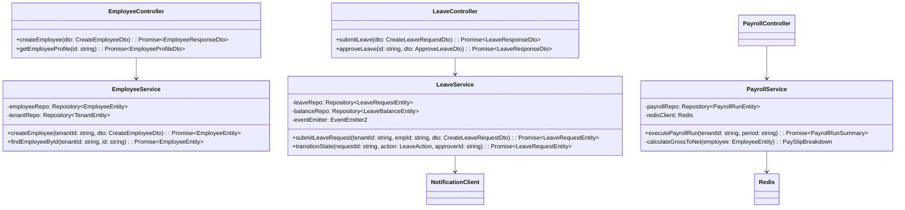

# Low-Level Design (LLD) Document
## System Name: WorkforcePulse Enterprise Platform

---

## 1. Enterprise Relational Database Schema (17 Tables)



---

## 2. Table-by-Table Data Dictionary (17 Entities)

### Group A: Identity, Multi-Tenancy & Security
1. **`tenants`**: Company accounts (`id`, `companyName`, `domain`, `status`, `createdAt`).
2. **`employees`**: Employee accounts (`id`, `tenantId`, `managerId`, `departmentId`, `positionId`, `firstName`, `lastName`, `email`, `passwordHash`, `status`, `createdAt`).
3. **`roles`**: System roles (`id`, `name`, `description`).
4. **`permissions`**: Fine-grained permissions (`id`, `action`, `resource`).
5. **`role_permissions`**: Mapping table linking roles to permissions.
6. **`user_roles`**: Mapping table linking employees to roles.
7. **`refresh_tokens`**: Hashed JWT refresh tokens with revocation support (`id`, `employeeId`, `hashedToken`, `expiresAt`, `isRevoked`).

### Group B: Organization Structure & Compensation
8. **`departments`**: Organizational units (`id`, `tenantId`, `name`, `code`).
9. **`positions`**: Job titles & grade levels (`id`, `tenantId`, `title`, `gradeLevel`).
10. **`compensations`**: Salary details (`id`, `employeeId`, `baseSalary`, `currency`, `payFrequency`, `effectiveDate`).
11. **`bank_details`**: Encrypted banking info (`id`, `employeeId`, `bankName`, `accountNumberMasked`, `routingNumberEncrypted`, `swiftCode`).

### Group C: Leave & Workflow Management
12. **`leave_types`**: Configurable leave types (`id`, `tenantId`, `name`, `defaultDaysPerYear`, `isPaid`).
13. **`leave_balances`**: Annual balance tracking (`id`, `employeeId`, `leaveTypeId`, `year`, `allocatedDays`, `usedDays`, `pendingDays`).
14. **`leave_requests`**: Leave applications (`id`, `tenantId`, `employeeId`, `leaveTypeId`, `startDate`, `endDate`, `totalDays`, `status`, `rejectionReason`).
15. **`leave_approvals`**: Approval history audit (`id`, `leaveRequestId`, `approverId`, `step`, `status`, `comments`, `createdAt`).

### Group D: Payroll, Outbox & Compliance
16. **`payroll_runs`**: Monthly/Bi-weekly payroll execution batches (`id`, `tenantId`, `period`, `totalGross`, `totalNet`, `status`, `executedAt`).
17. **`pay_slips`**: Individual pay slip records (`id`, `payrollRunId`, `employeeId`, `grossSalary`, `totalDeductions`, `netSalary`, `createdAt`).
18. **`pay_slip_items`**: Breakdown line items (`id`, `paySlipId`, `type`, `name`, `amount`).
19. **`outbox_events`**: Transactional outbox events (`id`, `eventType`, `payload`, `processed`).
20. **`audit_logs`**: Immutable compliance audit trail (`id`, `tenantId`, `actorId`, `action`, `entityType`, `entityId`, `oldValue`, `newValue`, `timestamp`).

---

## 3. Core State Machine Specifications

### Leave Request Approval State Machine



---

## 4. Redis Data Structure Specifications

### A. Sliding-Window Rate Limiter
- **Key Pattern**: `ratelimit:{tenant_id}:{window_timestamp}`
- **Algorithm**: Redis Sorted Set (ZSET)
  - Member: Unique Request ID
  - Score: Unix Timestamp in milliseconds

### B. Payroll Run Distributed Lock
- **Key Pattern**: `lock:payroll:{tenant_id}:{period}`
- **Command**: `SET lock:payroll:t123:2026-09 "LOCKED" NX EX 300`
- **Purpose**: Guarantees that two concurrent triggers of monthly payroll for the same period will never run in parallel.

---

## 5. API DTO Contracts & Response Schemas

### A. Authentication & Identity DTOs

#### `POST /api/v1/auth/login`
- **Request Payload**:
```json
{
  "email": "jane.doe@enterprise.com",
  "password": "SecurePassword123!",
  "tenantDomain": "enterprise"
}
```
- **Success Response (`200 OK`)**:
```json
{
  "statusCode": 200,
  "data": {
    "accessToken": "eyJhbGciOiJIUzI1NiIsInR5cCI6IkpXVCJ9...",
    "refreshToken": "d8f9a2b1c4e7...",
    "expiresIn": 900,
    "user": {
      "id": "emp_01H8X...",
      "tenantId": "tnt_01H8W...",
      "email": "jane.doe@enterprise.com",
      "firstName": "Jane",
      "lastName": "Doe",
      "roles": ["EMPLOYEE", "MANAGER"]
    }
  },
  "correlationId": "corr_99238471"
}
```

---

### B. Employee Onboarding DTOs

#### `POST /api/v1/employees` (Admin / HR)
- **Headers**: `Authorization: Bearer <token>`, `x-tenant-id: tnt_01H8W...`
- **Request Payload**:
```json
{
  "firstName": "Alice",
  "lastName": "Smith",
  "email": "alice.smith@enterprise.com",
  "departmentId": "dept_eng_01",
  "positionId": "pos_senior_dev",
  "managerId": "emp_01H8X...",
  "baseSalary": 125000.00,
  "currency": "USD",
  "payFrequency": "MONTHLY"
}
```
- **Success Response (`201 Created`)**:
```json
{
  "statusCode": 201,
  "data": {
    "id": "emp_02J9Y...",
    "tenantId": "tnt_01H8W...",
    "email": "alice.smith@enterprise.com",
    "status": "ACTIVE",
    "createdAt": "2026-09-11T07:30:00.000Z"
  },
  "correlationId": "corr_88472910"
}
```

---

### C. Leave Request Workflow DTOs

#### `POST /api/v1/leaves` (Submit Leave Application)
- **Request Payload**:
```json
{
  "leaveTypeId": "lt_annual_paid",
  "startDate": "2026-10-01",
  "endDate": "2026-10-05",
  "reason": "Annual family vacation"
}
```
- **Success Response (`201 Created`)**:
```json
{
  "statusCode": 201,
  "data": {
    "id": "lvr_03K1Z...",
    "employeeId": "emp_02J9Y...",
    "totalDays": 5,
    "status": "SUBMITTED",
    "createdAt": "2026-09-11T07:30:00.000Z"
  },
  "correlationId": "corr_77361524"
}
```

#### `POST /api/v1/leaves/:id/approve` (Manager / HR Decision)
- **Request Payload**:
```json
{
  "decision": "APPROVED",
  "comments": "Approved. Please ensure handoff to Alice."
}
```
- **Success Response (`200 OK`)**:
```json
{
  "statusCode": 200,
  "data": {
    "id": "lvr_03K1Z...",
    "status": "MANAGER_APPROVED",
    "approverId": "emp_01H8X...",
    "updatedAt": "2026-09-11T07:35:00.000Z"
  },
  "correlationId": "corr_55412983"
}
```

---

### D. Automated Payroll Execution DTOs

#### `POST /api/v1/payroll/execute` (Finance / Admin)
- **Request Payload**:
```json
{
  "period": "2026-09",
  "cutoffDate": "2026-09-25"
}
```
- **Success Response (`200 OK` or `202 Accepted`)**:
```json
{
  "statusCode": 200,
  "data": {
    "payrollRunId": "pr_04M2A...",
    "period": "2026-09",
    "processedEmployees": 142,
    "totalGross": 1775000.00,
    "totalNet": 1242500.00,
    "totalDeductions": 532500.00,
    "status": "COMPLETED",
    "executedAt": "2026-09-11T07:40:00.000Z"
  },
  "correlationId": "corr_11029384"
}
```

---

### E. Microservice Inter-Service TCP Payloads (NestJS `ClientTCP`)

#### Pattern: `create_leave_request` (Gateway ➔ Leave Microservice)
```json
{
  "pattern": "create_leave_request",
  "data": {
    "leaveTypeId": "lt_annual_paid",
    "startDate": "2026-10-01",
    "endDate": "2026-10-05"
  },
  "_correlationId": "corr_77361524",
  "_traceId": "4bf92f3577b34da6a3ce929d0e0e4736",
  "_carrier": {
    "traceparent": "00-4bf92f3577b34da6a3ce929d0e0e4736-00f067aa0ba902b7-01"
  }
}
```

---

## 6. Class Hierarchy, Service Interfaces & Method Signatures

### A. System Class Architecture (NestJS Tiered Pattern)



---

### B. Core Service Interfaces & Method Contracts

#### 1. `EmployeeService` (`libs/common/src/domain/employee/employee.service.interface.ts`)
```typescript
export interface IEmployeeService {
  /** Creates a new employee under a specific tenant */
  createEmployee(tenantId: string, dto: CreateEmployeeDto): Promise<EmployeeEntity>;
  
  /** Retrieves an employee profile ensuring tenant isolation */
  findEmployeeById(tenantId: string, id: string): Promise<EmployeeEntity>;
  
  /** Assigns RBAC roles to an employee */
  assignRoles(tenantId: string, employeeId: string, roleIds: string[]): Promise<void>;
}
```

#### 2. `LeaveService` (`libs/common/src/domain/leave/leave.service.interface.ts`)
```typescript
export interface ILeaveService {
  /** Submits a new leave request and validates balance */
  submitLeaveRequest(tenantId: string, employeeId: string, dto: CreateLeaveRequestDto): Promise<LeaveRequestEntity>;
  
  /** Evaluates state transition (SUBMITTED -> MANAGER_APPROVED -> HR_VERIFIED) */
  processApprovalStep(requestId: string, approverId: string, decision: ApprovalDecision, comments?: string): Promise<LeaveRequestEntity>;
  
  /** Locks leaves for a completed payroll period */
  lockLeavesForPayroll(tenantId: string, startDate: Date, endDate: Date): Promise<number>;
}
```

#### 3. `PayrollService` (`libs/common/src/domain/payroll/payroll.service.interface.ts`)
```typescript
export interface IPayrollService {
  /** Triggers monthly payroll processing using Redis distributed lock */
  executePayrollRun(tenantId: string, period: string): Promise<PayrollRunResultDto>;
  
  /** Calculates tax withholdings, gross salary, and net salary for an individual employee */
  computePaySlip(employee: EmployeeEntity, period: string): PaySlipBreakdown;
}
```

#### 4. `AccessControlService` (`libs/common/src/domain/access-control/access-control.service.interface.ts`)
```typescript
export interface IAccessControlService {
  /** Creates a new system or custom tenant role */
  createRole(dto: CreateRoleDto): Promise<RoleEntity>;
  
  /** Bulk updates permission boolean matrix for a role */
  updateRolePermissions(roleId: string, permissions: Record<string, boolean>): Promise<UpdatePermissionsResultDto>;
  
  /** Resolves cached user role details and boolean permission map for runtime guard evaluation */
  getCurrentUserRoleDetails(userId: string): Promise<{ user: UserRef; role: RoleRef; permissions: Record<string, boolean> }>;
}
```

#### 5. `OutboxRelayService` (`libs/common/src/outbox/outbox-relay.service.ts`)
```typescript
export interface IOutboxRelayService {
  /** Polling worker executed every 2000ms via cron timer */
  pollPendingEvents(): Promise<void>;
  
  /** Dispatches outbox event payload to Notification Service over TCP */
  dispatchEvent(event: OutboxEventEntity): Promise<boolean>;
}
```

---

### C. Cross-Cutting Guards & Interceptors

#### 1. `TenantGuard` (`libs/common/src/guards/tenant.guard.ts`)
- **Responsibility**: Extracts `x-tenant-id` header or JWT tenant claim; throws `403 Forbidden` if missing or inactive.
- **Signature**: `canActivate(context: ExecutionContext): boolean | Promise<boolean>`

#### 2. `PermissionGuard` (`libs/common/src/guards/permission.guard.ts`)
- **Responsibility**: Extracts required permission metadata via `Reflector.getAllAndOverride<string[]>(PERMISSIONS_KEY, ...)`, fetches cached user permission map, checks `userPermissions[requiredPerm] === true`; enforces fail-secure `403 Forbidden` if unverified.
- **Signature**: `canActivate(context: ExecutionContext): Promise<boolean>`

#### 3. `CorrelationInterceptor` (`libs/common/src/tracing/correlation.interceptor.ts`)
- **Responsibility**: Injects W3C `traceparent` and correlation headers into outgoing TCP microservice messages.
- **Signature**: `intercept(context: ExecutionContext, next: CallHandler): Observable<any>`

