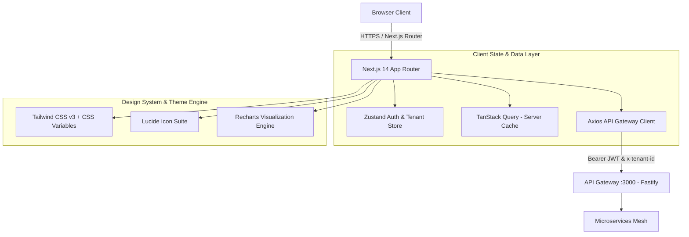
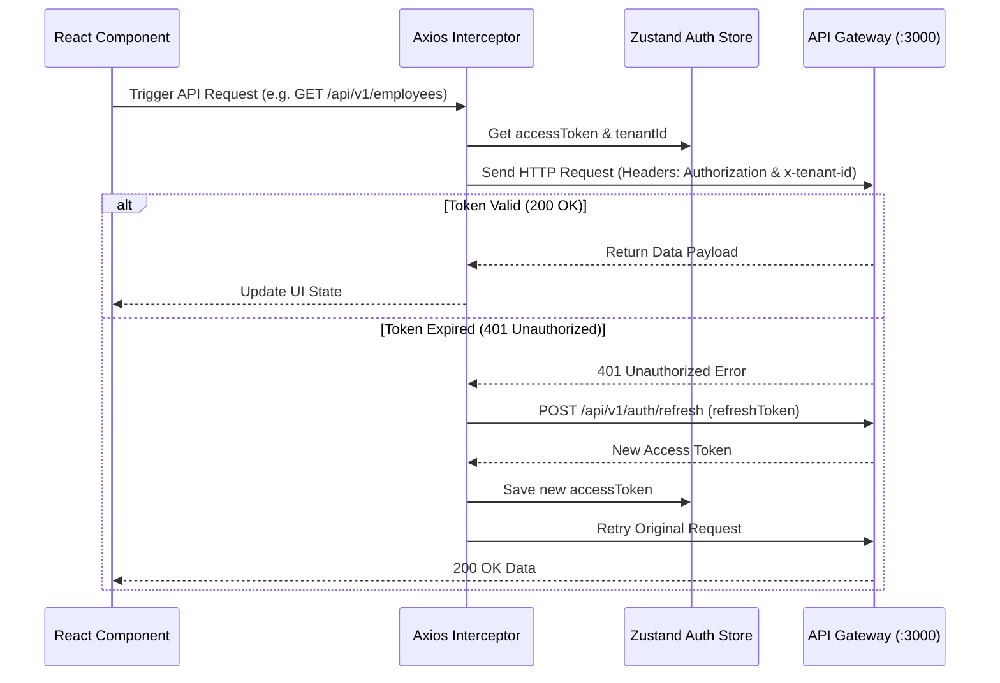

# Frontend High-Level Design (HLD) Document
## System Name: WorkforcePulse Enterprise Web Portal Architecture

---

## 1. Application Architecture Diagram



---

## 2. Directory Structure & App Architecture

```text
apps/web/
├── public/                     # Static assets & favicon
├── src/
│   ├── app/                    # Next.js 14 App Router Pages & Layouts
│   │   ├── (auth)/             # Unauthenticated Routes
│   │   │   ├── login/
│   │   │   └── register-tenant/
│   │   ├── (dashboard)/        # Authenticated Protected Layout
│   │   │   ├── dashboard/      # Executive HR & System Metrics
│   │   │   ├── employees/      # Employee Directory & Onboarding
│   │   │   ├── leaves/         # Leave State Machine Kanban & Submissions
│   │   │   ├── payroll/        # Monthly Payroll Engine & Payslips
│   │   │   └── telemetry/      # Live Kafka CDC Stream & Telemetry
│   │   ├── layout.tsx          # Root Layout (Theme, TanStack Query Provider)
│   │   └── page.tsx            # Root Entry & Redirect Handler
│   ├── components/             # Design System & Feature Components
│   │   ├── ui/                 # Atomic UI Components (Button, Input, Modal, Badge, Card, Drawer)
│   │   ├── layout/             # Sidebar, Header, TenantSelector, RoleSwitcher
│   │   ├── dashboard/          # MetricCards, DepartmentChart, HealthStatus
│   │   ├── employees/          # EmployeeTable, OnboardModal, EmployeeDrawer
│   │   ├── leaves/             # LeaveKanban, SubmitLeaveModal, BalanceMeters
│   │   ├── payroll/            # PayrollControlPanel, PayslipModal, GrossNetCard
│   │   └── telemetry/          # KafkaCdcFeed, OpenTelemetryGraph
│   ├── hooks/                  # Custom React Hooks & Data Queries
│   │   ├── useAuth.ts          # Login, Register, Logout, Refresh Token
│   │   ├── useEmployees.ts     # Employee CRUD operations
│   │   ├── useLeaves.ts        # Leave State Machine transitions & balances
│   │   ├── usePayroll.ts       # Payroll execution & payslip fetching
│   │   └── useTelemetry.ts     # Live CDC stream subscriber
│   ├── lib/                    # Core Utilities & Clients
│   │   ├── api-client.ts       # Axios instance with JWT & x-tenant-id interceptors
│   │   └── utils.ts            # Formatting, currency, date helpers
│   ├── store/                  # Zustand Global State
│   │   └── useAuthStore.ts     # Token, Tenant ID, Active User & Role state
│   └── types/                  # TypeScript Data Contracts
│       ├── auth.types.ts
│       ├── employee.types.ts
│       ├── leave.types.ts
│       └── payroll.types.ts
├── tailwind.config.js          # Enterprise Slate Theme Tokens
└── tsconfig.json
```

---

## 3. Page Routing Tree & Navigation Topology

| Path | Access Level | Primary Feature / Component | API Gateway Endpoints Called |
| :--- | :--- | :--- | :--- |
| **`/login`** | Public | JWT Login Form & Tenant Domain Selection | `POST /api/v1/auth/login` |
| **`/register-tenant`** | Public | B2B Tenant Registration Form | `POST /api/v1/auth/register-tenant` |
| **`/dashboard`** | Protected | Executive HR Metrics, System Health, Quick Actions | `GET /metrics`, `GET /api/v1/employees/me` |
| **`/employees`** | Protected (`ADMIN`, `HR_MANAGER`) | Employee Grid, Onboarding Modal, Profile Drawer | `GET /api/v1/employees`, `POST /api/v1/employees` |
| **`/leaves`** | Protected (All Roles) | State Machine Kanban, Balance Meters, Approval Dialogs | `GET /api/v1/leaves`, `POST /api/v1/leaves`, `POST /api/v1/leaves/:id/approve` |
| **`/payroll`** | Protected (`ADMIN`, `HR_MANAGER`) | Payroll Execution Panel, Payslip Download Modal | `POST /api/v1/payroll/execute`, `GET /api/v1/payroll/slips/me` |
| **`/telemetry`** | Protected (`ADMIN`) | Live Kafka CDC Stream, OTLP Trace Graph | `GET /metrics`, Event Listener |

---

## 4. State Management & API Interceptor Architecture



---

## 5. Enterprise Design Tokens & Styling System

The application uses **Tailwind CSS v3** extended with custom CSS variables:

- **Background Palette:** `#090d16` (Obsidian Base), `#111827` (Card Surface), `#1f293d` (Hover Surface).
- **Primary Accent:** `#6366f1` (Indigo), `#818cf8` (Light Indigo).
- **Status Accents:**
  - `APPROVED` / `COMPLETED`: `#10b981` (Emerald)
  - `SUBMITTED` / `PENDING`: `#f59e0b` (Amber)
  - `REJECTED` / `ERROR`: `#ef4444` (Rose)
  - `PAYROLL_LOCKED`: `#8b5cf6` (Purple)
- **Typography:** `Plus Jakarta Sans` / `Inter` font stack with tabular numbers (`font-mono`) for payroll financials.
