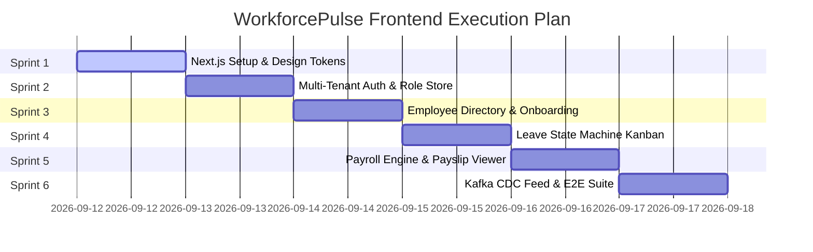

# Frontend 6-Sprint Execution Roadmap
## Project Name: WorkforcePulse Enterprise Web Application

---

## 📅 Master Sprint Timeline

---

## 🚀 Detailed Sprint Breakdown

### 🔹 Sprint 1: Foundation, Design System & API Client
- **Goal:** Initialize Next.js 14 (App Router) in `apps/web` with Tailwind CSS v3, dark slate theme, and Axios client with JWT/Tenant interceptors.
- **Tasks:**
  1. Initialize Next.js app in `apps/web` using `npx create-next-app@latest`.
  2. Configure Tailwind CSS v3 slate/obsidian palette, font stack, and CSS variable design tokens.
  3. Create Axios API client (`src/lib/api-client.ts`) with automatic Bearer JWT injection and 401 refresh token retry interceptor.
  4. Create Zustand Auth & Tenant Store (`src/store/useAuthStore.ts`).
  5. Build atomic UI primitives (`Button`, `Card`, `Badge`, `Input`, `Modal`).

### 🔹 Sprint 2: Multi-Tenant Authentication & Role Portal
- **Goal:** Build B2B tenant registration, JWT authentication pages, tenant switcher, and dynamic role guards.
- **Tasks:**
  1. Build `/login` page with tenant domain input, email/password validation, and error alerts.
  2. Build `/register-tenant` page for bootstrapping new B2B client companies (`POST /api/v1/auth/register-tenant`).
  3. Build top navigation bar with active Tenant Context Badge and dynamic Role Switcher (`ADMIN`, `HR_MANAGER`, `LINE_MANAGER`, `EMPLOYEE`).
  4. Create authenticated layout wrapper with JWT token verification middleware.

### 🔹 Sprint 3: Employee Directory & Onboarding Drawer
- **Goal:** Build the interactive employee directory, department filters, and onboarding form modal.
- **Tasks:**
  1. Build `/employees` page with searchable, paginated employee grid.
  2. Build Employee Onboarding Modal (`POST /api/v1/employees`) with salary, department, position, and manager dropdowns.
  3. Build Slide-over Employee Profile Drawer displaying reporting chains, role assignments, and compensation history.

### 🔹 Sprint 4: Leave Approval State Machine Kanban
- **Goal:** Build the interactive leave approval workflow board, balance meters, and decision modals.
- **Tasks:**
  1. Build `/leaves` page featuring visual 4-column Kanban board (`SUBMITTED`, `MANAGER_APPROVED`, `HR_VERIFIED`, `PAYROLL_LOCKED`).
  2. Build Leave Request Modal (`POST /api/v1/leaves`) with automatic day calculation and category selector.
  3. Build Manager & HR approval decision action buttons (`Approve`, `Reject`, `Verify`) with comment dialogs.
  4. Build annual leave balance visual progress meters (`Vacation`, `Sick`, `Parental`).

### 🔹 Sprint 5: Automated Monthly Payroll Engine & Payslips
- **Goal:** Build the payroll execution dashboard, Redis lock indicator, gross-to-net tax breakdown, and itemized payslip viewer.
- **Tasks:**
  1. Build `/payroll` page featuring monthly payroll run trigger panel (`POST /api/v1/payroll/execute`).
  2. Build real-time Redis lock status indicator (`lock:payroll:{tenant}:{period}`).
  3. Build Gross-to-Net Summary Cards (20% Income Tax, 5% Health Insurance, Net Pay).
  4. Build printable/downloadable itemized Payslip Modal viewer.

### 🔹 Sprint 6: Live Kafka CDC Feed, Telemetry Stream & E2E Testing
- **Goal:** Build real-time Kafka CDC outbox log feed, OpenTelemetry trace waterfall viewer, and complete E2E testing suite.
- **Tasks:**
  1. Build `/telemetry` page featuring live terminal-style streaming feed of Kafka CDC outbox events.
  2. Build OpenTelemetry W3C trace span visualization graph.
  3. Write Cypress/Playwright or Jest E2E integration test suite for frontend user flows.
  4. Perform final build verification (`npm run build`) and git commit.
