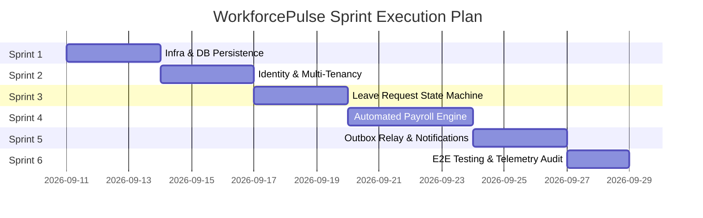

# WorkforcePulse Enterprise Platform - Sprint Execution Plan & Milestone Roadmap

---

## Executive Summary
This document breaks down the end-to-end engineering implementation of **WorkforcePulse** into **6 systematic, milestone-driven Sprints**. Each Sprint has explicit deliverables, acceptance criteria, testing requirements, and telemetry validation checks to ensure zero skipped steps, zero technical debt, and maximum production quality.

---

---

## 🏃 Sprint 1: Infrastructure, Database & Core Persistence Layer

### 🎯 Objective
Spin up PostgreSQL 16 and Redis 7 in Docker, install ORM dependencies, configure connection pools, and create TypeORM Entity models for all 17 normalized schema tables.

### 📋 Task Breakdown
- [x] **1.1 Container Infrastructure**: Update `docker-compose.yml` to include `postgres` (`:5432`) and `redis` (`:6379`).
- [x] **1.2 Package Dependencies**: Install `typeorm`, `@nestjs/typeorm`, `pg`, and `ioredis`.
- [x] **1.3 Environment Config**: Update `@app/common` `ConfigKeys` & default values for PostgreSQL and Redis connection strings.
- [x] **1.4 TypeORM Entities**: Create entity definitions in `libs/common/src/database/entities/`:
  - **Identity/Tenant**: `TenantEntity`, `EmployeeEntity`, `RoleEntity`, `PermissionEntity`, `RolePermissionEntity`, `UserRoleEntity`, `RefreshTokenEntity`.
  - **Org/Comp**: `DepartmentEntity`, `PositionEntity`, `CompensationEntity`, `BankDetailEntity`.
  - **Leave**: `LeaveTypeEntity`, `LeaveBalanceEntity`, `LeaveRequestEntity`, `LeaveApprovalEntity`.
  - **Payroll/Compliance**: `PayrollRunEntity`, `PaySlipEntity`, `PaySlipItemEntity`, `OutboxEventEntity`, `AuditLogEntity`.
- [x] **1.5 Database Module**: Create and export `DatabaseModule` in `@app/common/database/database.module.ts`.

### ✅ Acceptance Criteria & Quality Gate
1. `docker-compose up -d postgres redis` starts cleanly without errors.
2. `npx tsc --noEmit` passes with **0 TypeScript errors**.
3. NestJS applications successfully initialize database connection pools on boot.

---

## 🏃 Sprint 2: Identity, Authentication & Multi-Tenancy (Employee Service)

### 🎯 Objective
Implement JWT Authentication, Password Hashing, Refresh Token Rotation, Tenant Isolation Guard, and Employee Onboarding APIs.

### 📋 Task Breakdown
- [x] **2.1 Security Utilities**: Implement password hashing (bcrypt/argon2) and JWT strategy (`JwtAuthGuard`) in `@app/common`.
- [x] **2.2 Multi-Tenant Guard**: Build `TenantGuard` to validate `x-tenant-id` header and JWT tenant claims.
- [x] **2.3 Authentication APIs**:
  - `POST /api/v1/auth/register-tenant`: Bootstraps new tenant and root admin employee.
  - `POST /api/v1/auth/login`: Validates credentials, issues Access (15m) & Refresh (7d) tokens.
  - `POST /api/v1/auth/refresh`: Rotates refresh tokens and issues fresh access tokens.
- [x] **2.4 Employee Management APIs**:
  - `POST /api/v1/employees`: Creates employee, department link, position, and base salary.
  - `GET /api/v1/employees/me`: Retrieves authenticated user profile.
  - `GET /api/v1/employees/:id`: HR/Admin lookup endpoint.
- [x] **2.5 Audit Logging**: Automatically write employee creation/updates to `audit_logs`.

### ✅ Acceptance Criteria & Quality Gate
1. Auth API returns signed JWTs with valid correlation IDs.
2. Accessing employee endpoints without `x-tenant-id` or valid JWT returns `401 Unauthorized` / `403 Forbidden`.
3. Unit tests for `AuthService` and `EmployeeService` pass.

---

## 🏃 Sprint 3: Leave Request Approval State Machine (Leave Service)

### 🎯 Objective
Build the Leave Request lifecycle engine (`SUBMITTED` ➔ `MANAGER_APPROVED` ➔ `HR_VERIFIED` ➔ `PAYROLL_LOCKED`) with balance checks and atomic transactional outbox events.

### 📋 Task Breakdown
- [ ] **3.1 Leave Balance Allocation**: Auto-generate annual `LeaveBalanceEntity` records when an employee is onboarded.
- [ ] **3.2 Submit Leave Request**: `POST /api/v1/leaves`
  - Validates date range logic (end date > start date).
  - Checks if available balance >= requested days.
  - Deducts pending days and sets status to `SUBMITTED`.
- [ ] **3.3 Approval Workflow**: `POST /api/v1/leaves/:id/approve` & `reject`
  - Enforces manager/HR authorization checks.
  - Transitions state to `MANAGER_APPROVED` or `REJECTED`.
  - Records step entry in `leave_approvals`.
- [ ] **3.4 Atomic Outbox Event**: Inserts `leave.submitted` / `leave.approved` into `outbox_events` within the same DB transaction.

### ✅ Acceptance Criteria & Quality Gate
1. Attempting to submit leave exceeding available balance throws `400 Bad Request`.
2. State transitions follow strict allowed paths (`SUBMITTED` ➔ `MANAGER_APPROVED` ➔ `HR_VERIFIED`).
3. Outbox event is saved atomically with leave state change.

---

## 🏃 Sprint 4: Automated Monthly Payroll Engine (Payroll Service)

### 🎯 Objective
Build Redis-locked monthly gross-to-net salary calculations, tax withholdings, deduction breakdowns, and pay slip generation.

### 📋 Task Breakdown
- [ ] **4.1 Distributed Lock Guard**: Implement Redis lock (`lock:payroll:{tenant_id}:{period}`) with 300s TTL to prevent concurrent execution.
- [ ] **4.2 Execute Payroll Run**: `POST /api/v1/payroll/execute`
  - Fetches active employees under the tenant.
  - Computes gross salary, tax withholdings (20%), health insurance (5%), and net salary.
  - Generates `PayrollRunEntity`, `PaySlipEntity`, and itemized `PaySlipItemEntity` records.
- [ ] **4.3 Leave Locking**: Locks all approved leaves for the period (`status = 'PAYROLL_LOCKED'`).
- [ ] **4.4 Employee Payslip Lookup**: `GET /api/v1/payroll/slips/me` & `GET /api/v1/payroll/slips/:id`.

### ✅ Acceptance Criteria & Quality Gate
1. Concurrent calls to execute payroll for the same period return `409 Conflict` (Redis lock active).
2. Payslip net calculation equals `Gross - Deductions` exactly.
3. Unit tests for `PayrollService` math logic pass.

---

## 🏃 Sprint 5: Transactional Outbox Relay & Notification Service

### 🎯 Objective
Process `outbox_events` reliably using a background relay worker and dispatch HTML email notifications with zero event loss.

### 📋 Task Breakdown
- [ ] **5.1 Outbox Polling Relay**: Implement `OutboxRelayService` running every 2,000ms using `@nestjs/schedule`.
- [ ] **5.2 Microservice Event Dispatcher**: Send outbox events to `notification-service` over ClientTCP socket.
- [ ] **5.3 Email Templates**: Render clean HTML templates for:
  - Welcome Employee Onboarding
  - Leave Submitted / Approved / Rejected Alerts
  - Monthly Payslip Available Notification
- [ ] **5.4 Idempotency & Retries**: Mark `outbox_events.processed = true` on ACK; retry failed events up to 3 times.

### ✅ Acceptance Criteria & Quality Gate
1. Events written to `outbox_events` are picked up and processed within 2 seconds.
2. Failed notifications retry cleanly without duplicating processed events.

---

## 🏃 Sprint 6: End-to-End Testing, Telemetry Audit & Final Benchmarking

### 🎯 Objective
Run end-to-end integration tests across all microservices, audit distributed tracing in Grafana Tempo, verify Prometheus metrics with exemplars, and perform load testing.

### 📋 Task Breakdown
- [ ] **6.1 E2E Test Suite**: Full lifecycle integration test:
  `Login` ➔ `Onboard Employee` ➔ `Submit Leave` ➔ `Approve Leave` ➔ `Execute Payroll` ➔ `Verify Payslip & Outbox Event`.
- [ ] **6.2 Telemetry Verification**:
  - Open Grafana Tempo (`http://localhost:3000`) and verify complete trace graphs across Gateway ➔ Microservices ➔ PostgreSQL queries.
  - Inspect Pino JSON logs to confirm `traceId`, `spanId`, and `correlationId` presence.
  - Scrape `/metrics` to verify `http_request_duration_seconds` histograms with trace exemplars.
- [ ] **6.3 Final Code Hygiene**: Run `npx tsc --noEmit` and `npm test` across all libs and services.

### ✅ Acceptance Criteria & Quality Gate
1. 100% test pass rate across unit and E2E suites.
2. Complete W3C trace propagation visible in Tempo for every request trajectory.
3. Clean build with zero TypeScript or linting warnings.
